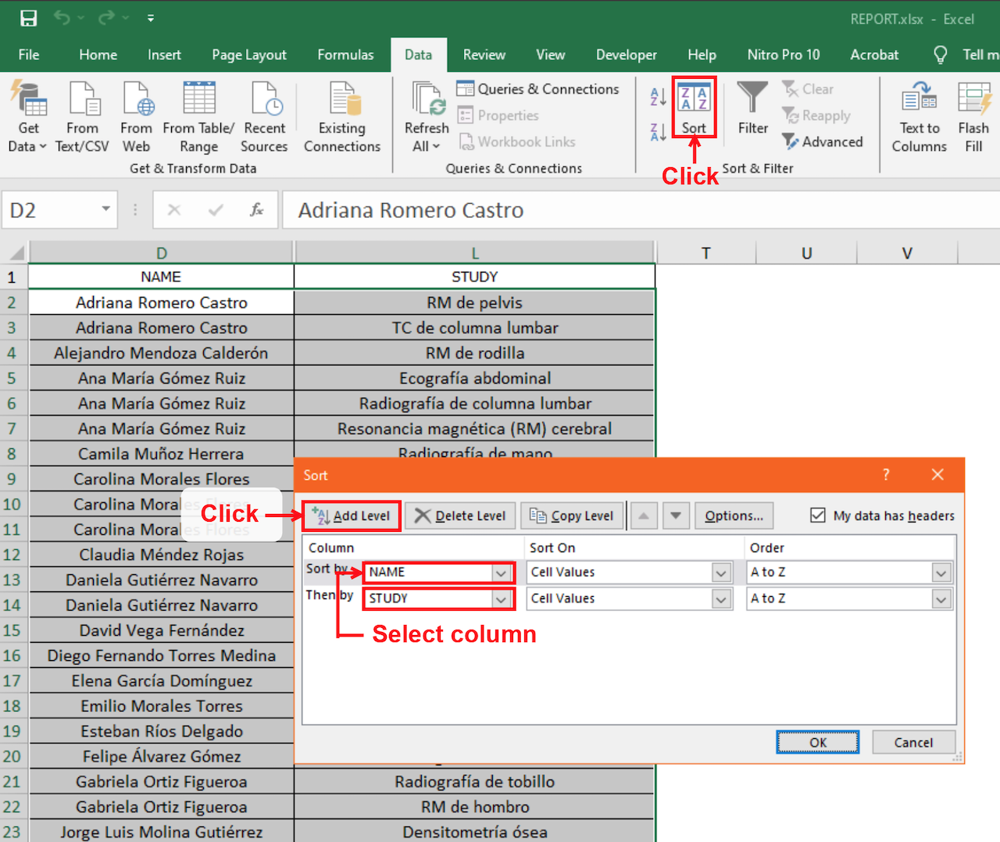

# File Verification in the Report
This is a script developed for Windows that allows you to verify the record of PDF files within a spreadsheet. In addition, it generates a summary that includes lists of documents out of report and users with duplicate cells or files.

## ⚙️ How does it work?
1. Extracts the information contained in the PDF files and in the spreadsheet.
2. Organizes in a list the common information between the PDFs and the spreadsheet.
3. Highlights in green the cells in the spreadsheet that match the data in the list.
4. Generates a summary based on the set operations performed between the data in the documents and the spreadsheet.

## 📦 Installation
1. Installs version 3.12 of Python.
2. Run the following command in the terminal (CMD) to clone the project:
~~~
git clone https://github.com/D4v1d123/Check-files-in-report.git
~~~
3. Run the following command in the terminal (CMD) to install the project dependencies:
~~~
python3 -m pip install -r requirements.txt
~~~
4. Configure your favorite code editor to run Python, or use an IDE such as PyCharm or Spyder.

## 💻 Usage
1. Sort the column containing the study names based on the user name column in the spreadsheet, as shown in the image below.

2. Open the project in your editor or IDE.
3. At the bottom of the script, you will find the following variables that you need to set:
   - **`spreadsheet_path`**: Path of the spreadsheet containing the file records.
   - **`files_path`**: Path of the PDF documents that will be verified in the spreadsheet.
   - **`invalid_files_path`**: Path where the PDFs that the script could not read will be stored.
   - **`patients_column`**: Column letter in the spreadsheet where the names of the users are recorded.
   - **`study_column`**: Column letter where the user studies are recorded.
   - **`sheet`**: Name of the sheet in which the search will be performed.

## 📚 Dependencies
- Python 3.12+
- Unidecode 1.3.8
- openpyxl 3.1.5
- PyPDF2 3.0.1